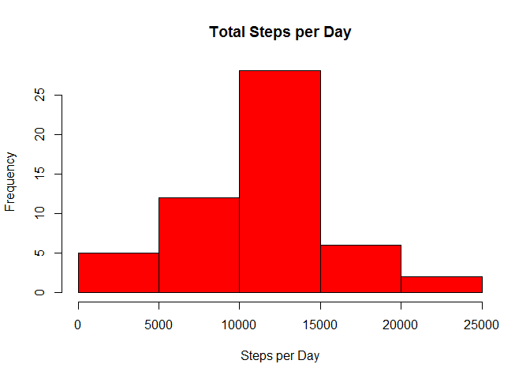
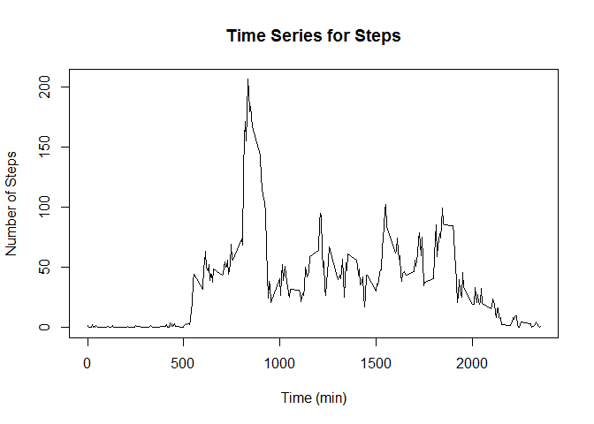
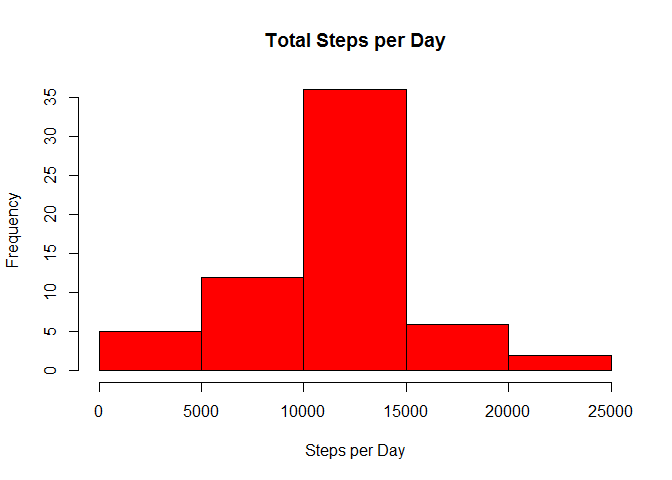
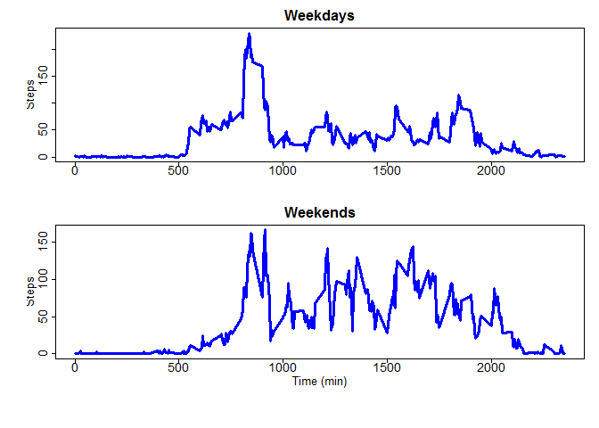

# Activity Pattern (Steps)


##Download and process the data

We set the proper working directory


```r
setwd("D:/Data Science/Coursera/Reprod research/W2")
```

and we create the file to download the data


```r
  if(!file.exists("./data")){
                dir.create("./data")
        }
```

Then we download the data file from the given URL and unzip


```r
fileUrl <- "http://d396qusza40orc.cloudfront.net/repdata%2Fdata%2Factivity.zip"
download.file(fileUrl, destfile = "./data/data.zip")

unzip(zipfile = "./data/data.zip", exdir = "./data")
```

The data are separated by commas so we read it as csv file. Also, we convert the dates to "date" objects using lubridate.


```r
Data <- read.csv("./data/activity.csv") 
library(lubridate)
```

```
## Warning: package 'lubridate' was built under R version 3.3.2
```

```
## 
## Attaching package: 'lubridate'
```

```
## The following object is masked from 'package:base':
## 
##     date
```

```r
Data$date <-ymd(Data$date)
```

##Total steps per day

Then, we calculate the total steps for each day using the tapply function. The later will give back a vector with the total values for each day. It is straightforward to observe the frequency of the observations by plotting also a histogram.


```r
dm <- with(Data, tapply(steps, date, sum))

hist(dm, col = "red", 
       main = "Total Steps per Day", 
       xlab = "Steps per Day")
```

<!-- -->

From the histogram we observe that we have an almost normal distribution with a pick between 10.000 and 15.000 steps. Indeed, taking the summary of the previous distribution we get


```r
summary(dm)
```

```
##    Min. 1st Qu.  Median    Mean 3rd Qu.    Max.    NA's 
##      41    8841   10760   10770   13290   21190       8
```

Hence, it is evident that the distribution is symmetric since the median value is almost equal to the mean value.

##Average daily activity pattern

We calculate the mean value of steps for each 5 minutes across all days. 


```r
ds <- with(Data, tapply(steps, interval, mean, na.rm = TRUE))
```
 The names of the resulting vector are the time intervals. So, for the time series plot we assign the names of the vector at the "x" axis, while at the "y" axis we put the average steps.
 
 
 ```r
 plot(names(ds), ds, type = "l",main= "Time Series for Steps", xlab= "Time (min)", ylab = "Number of Steps")
 ```
 
 <!-- -->
 
 To find the time interval where we get the maximum value of steps, on average for each day, we combine the "which" and the "max" functions to find the "name" of the particular time interval


```r
names(which(ds == max(ds)))
```

```
## [1] "835"
```
The above value are the minutes where the maximum.

##Imputing missing values

The number of NA's in the observations are above the 10% so they affect our calculations. To observe this we sum the number of NAs and then divide by the number of all observations.


```r
sum(is.na(Data$steps))
```

```
## [1] 2304
```
The proportion of the NAs is given by the following chunk


```r
sum(is.na(Data$steps))/length(Data$steps)
```

```
## [1] 0.1311475
```
and this calculation implies that approximately 13% of the rows contain missing values. Therefore, the NAs critically affect our calculations. 

For that reason we replace the missing values with the average value of steps acrooss all days at the current time interval. We use the vector 'ds' where we have stored the average values.


```r
DataR <- Data

for (i in 1:nrow(Data)) {
        
        if(is.na(DataR$steps[i]) == TRUE){
                ts <- as.character(DataR$interval[i])
                DataR$steps[i] <- ds[ts] 
        }
}
head(DataR)
```

```
##       steps       date interval
## 1 1.7169811 2012-10-01        0
## 2 0.3396226 2012-10-01        5
## 3 0.1320755 2012-10-01       10
## 4 0.1509434 2012-10-01       15
## 5 0.0754717 2012-10-01       20
## 6 2.0943396 2012-10-01       25
```
It is evident that in the new data frame the missing values have been replaced.

We calculate again the average number of total steps for each day to investigate the inpact of the replaced missing values.


```r
dmR <- with(DataR, tapply(steps, date, sum))

hist(dmR, col = "red", 
       main = "Total Steps per Day", 
       xlab = "Steps per Day")
```

<!-- -->
Again, the new distribution is almost Gaussian but with a smaller variance. Taking the summary we get

```r
summary(dmR)
```

```
##    Min. 1st Qu.  Median    Mean 3rd Qu.    Max. 
##      41    9819   10770   10770   12810   21190
```
It is evident that the mean and the median are almost the same. Thus the expectation value is the same and the distribution remaremains normal. However, compering the new values of the 1st and the 3rd quarter with the old ones, we confirm that we get a smaller variance. 

##Actinity Patterns(Weeksays Vs Weekends)

We want to investigate the differences in the activity pattern between weekdays and weekends. For that reason we add a new variable to our new data frame that distinguishes between these. 


```r
DataW <- DataR

for (i in 1:nrow(DataW)) {
        
        if(wday(DataW$date[i])== 7 | wday(DataW$date[i])== 1){
                
                DataW$Day[i] <- "Weekend"
                
        }else{ 
                DataW$Day[i] <- "Weekday"
        }
        
}

head(DataW)
```

```
##       steps       date interval     Day
## 1 1.7169811 2012-10-01        0 Weekday
## 2 0.3396226 2012-10-01        5 Weekday
## 3 0.1320755 2012-10-01       10 Weekday
## 4 0.1509434 2012-10-01       15 Weekday
## 5 0.0754717 2012-10-01       20 Weekday
## 6 2.0943396 2012-10-01       25 Weekday
```
Then we split the data frame with respect to the 'Day' variable and we define to new dataframes, one for the weekdays and one for the weekends.

```r
dsd <- split(DataW, DataW$Day)

Dat_day <- dsd$Weekday
Dat_end <- dsd$Weekend
```
For each data frame we compute the average steps for each time interval, across all days.

```r
dmR_day <- with(Dat_day, tapply(steps, interval, mean))
dmR_end <- with(Dat_end, tapply(steps, interval, mean))
```
and we make the panel plot

```r
par(mfrow = c(2, 1), cex = 0.4, cex.lab =2, cex.main =2.5, cex.axis=2.2,
     oma = c(5,4,0,0))

plot(names(dmR_day),dmR_day, type = "l", main = "Weekdays",
     xlab = "", ylab = "Steps", col = "blue", lwd =3)

plot(names(dmR_end),dmR_end, type = "l", main = "Weekends",
     xlab = "Time (min)", ylab = "Steps", col = "blue", lwd =3)
```

<!-- -->

From the two plots it is evident that the subject was more active on weekends.


